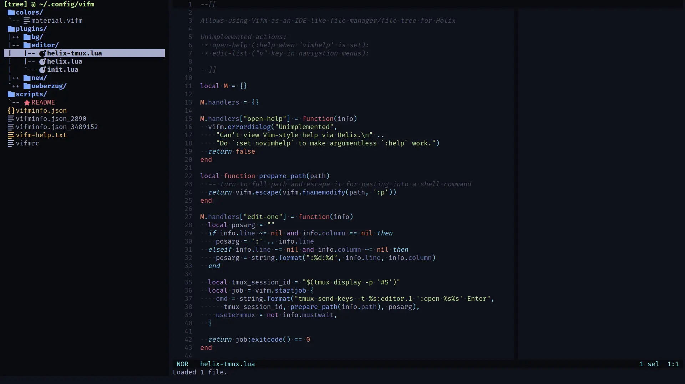

# material.vifm
[Helix](https://helix-editor.com/) colorscheme similar to [material.vim](https://github.com/kaicataldo/material.vim)/[material.nvim](https://github.com/marko-cerovac/material.nvim)

